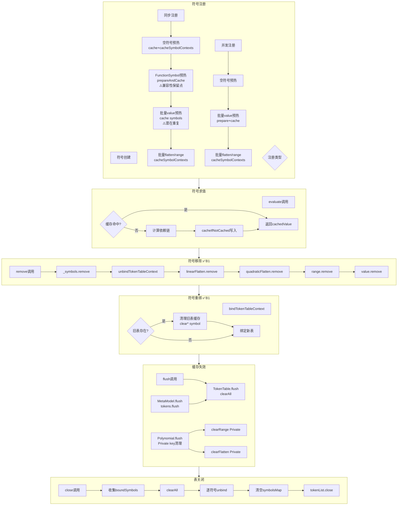

# 缓存生命周期分析（2026-04-16）

> 基于 cache-usage.md 清单，绘制完整的缓存绑定/解绑/失效/移除生命周期图

---

## 1. 生命周期总览（ASCII 图）

```
┌─────────────────────────────────────────────────────────────────────────┐
│                        缓存生命周期全景图                                  │
└─────────────────────────────────────────────────────────────────────────┘

                              [符号创建]
                                  │
                                  ▼
┌─────────────────────────────────────────────────────────────────────────┐
│                           [符号注册]                                      │
│                                                                           │
│  ┌──────────────────────────┐    ┌──────────────────────────────────┐    │
│  │     同步注册链路          │    │         并发注册链路               │    │
│  │  (MutableTokenTable)      │    │  (ConcurrentMutableTokenTable)    │    │
│  └──────────────────────────┘    └──────────────────────────────────┘    │
│           │                                    │                          │
│           ▼                                    ▼                          │
│  ┌──────────────────────────┐    ┌──────────────────────────────────┐    │
│  │ 1. 空符号预热             │    │ 1. 空符号预热                     │    │
│  │    cache(emptySymbols)    │    │    cache(emptySymbols)            │    │
│  │    cacheSymbolContexts()  │    │    cacheSymbolContexts()          │    │
│  └──────────────────────────┘    └──────────────────────────────────┘    │
│           │                                    │                          │
│           ▼                                    ▼                          │
│  ┌──────────────────────────┐    ┌──────────────────────────────────┐    │
│  │ 2. FunctionSymbol预热     │    │ 2. 批量预热                       │    │
│  │    prepareAndCache()      │    │    prepare() + cache(symbols)    │    │
│  │    [⚠️ 兼容性保留点]       │    │    [无重复]                       │    │
│  │    cache(cacheKey=symbol) │    │                                  │    │
│  └──────────────────────────┘    └──────────────────────────────────┘    │
│           │                                    │                          │
│           ▼                                    ▼                          │
│  ┌──────────────────────────┐    ┌──────────────────────────────────┐    │
│  │ 3. 批量value预热(B2新增)  │    │ 3. 批量flatten/range预热          │    │
│  │    cache(symbols=map)     │    │    cacheSymbolContexts()          │    │
│  │    [⚠️ 潜在重复]          │    │    (分批/单批/单线程)             │    │
│  └──────────────────────────┘    └──────────────────────────────────┘    │
│           │                                    │                          │
│           ▼                                    ▼                          │
│  ┌──────────────────────────┐    ┌──────────────────────────────────┐    │
│  │ 4. 批量flatten/range预热 │    │                                  │    │
│  │    cacheSymbolContexts()  │    │                                  │    │
│  └──────────────────────────┘    └──────────────────────────────────┘    │
│                                                                           │
│  ═════════════════════════════════════════════════════════════════════   │
│  注册后缓存状态：                                                          │
│  ├─ Symbol → TokenTable 绑定完成                                          │
│  ├─ value 缓存：命中可用                                                   │
│  ├─ linear/quadratic flatten 缓存：命中可用                                │
│  ├─ range 缓存：命中可用                                                   │
│  ═════════════════════════════════════════════════════════════════════   │
└─────────────────────────────────────────────────────────────────────────┘
                                  │
                                  ▼
┌─────────────────────────────────────────────────────────────────────────┐
│                         [符号求值]                                        │
│                                                                           │
│  evaluateWithCachedTokenTable:                                            │
│  ├─ 检查 tokenTable.cachedSolution                                        │
│  ├─ 若命中：直接返回 cachedValue                                           │
│  ├─ 若未命中：计算依赖链 + cacheIfNotCached                                │
│  └─────────────────────────────────────────────────────────────────────  │
│                                                                           │
│  缓存命中路径：                                                            │
│  tokenTable.cacheIfNotCached(cacheKey=symbol, solution, value)            │
│  ├─ getOrPut 模式                                                         │
│  ├─ 已缓存：直接返回                                                       │
│  ├─ 未缓存：计算依赖 + 写入缓存                                            │
└─────────────────────────────────────────────────────────────────────────┘
                                  │
                                  ▼
┌─────────────────────────────────────────────────────────────────────────┐
│                         [符号移除] ✅ B1已实现                             │
│                                                                           │
│  remove(symbol) 触发链路：                                                 │
│                                                                           │
│  ┌─────────────────────────────────────────────────────────────────────┐ │
│  │  MutableTokenTable.remove(symbol)                                     │ │
│  │  ├─ _symbols.remove(symbol)                                           │ │
│  │  ├─ _symbolsMap.remove(symbol.name)                                   │ │
│  │  ├─ unbindTokenTableContext(symbol, this)   ← 解绑上下文               │ │
│  │  ├─ cacheContexts.linearFlatten.remove(symbol)  ← 清理flatten         │ │
│  │  ├─ cacheContexts.quadraticFlatten.remove(symbol)                     │ │
│  │  ├─ cacheContexts.range.remove(symbol)  ← 清理range                   │ │
│  │  ├─ cacheContexts.value.remove(symbol)  ← 清理value（B1新增）          │ │
│  └─────────────────────────────────────────────────────────────────────┘ │
│                                                                           │
│  ┌─────────────────────────────────────────────────────────────────────┐ │
│  │  ConcurrentMutableTokenTable.remove(symbol)                           │ │
│  │  ├─ synchronized(lock) { ... 同上 ... }                               │ │
│  └─────────────────────────────────────────────────────────────────────┘ │
│                                                                           │
│  移除后缓存状态：                                                          │
│  ├─ Symbol → TokenTable 绑定解除                                          │
│  ├─ 四类缓存全部清空                                                       │
│  ├─ 符号可重新注册到同一表                                                  │
└─────────────────────────────────────────────────────────────────────────┘
                                  │
                                  ▼
┌─────────────────────────────────────────────────────────────────────────┐
│                         [符号重绑] ✅ B1已实现                             │
│                                                                           │
│  场景：符号从旧 TokenTable 绑定到新 TokenTable                              │
│                                                                           │
│  bindTokenTableContext(symbol, newTable):                                 │
│  ├─ 检查 oldTokenTable = symbolTokenTableContext[symbol]                  │
│  ├─ 若 oldTokenTable != null && oldTokenTable != newTable:               │
│  │     ├─ oldTokenTable.clearLinearFlatten(symbol)   ← 清理旧表flatten   │
│  │     ├─ oldTokenTable.clearQuadraticFlatten(symbol)                    │
│  │     ├─ oldTokenTable.clearRange(symbol)           ← 清理旧表range     │
│  │     ├─ oldTokenTable.clearValue(symbol)           ← 清理旧表value     │
│  ├─ symbolTokenTableContext[symbol] = newTable   ← 绑定新表              │
│                                                                           │
│  重绑后状态：                                                              │
│  ├─ Symbol → newTokenTable 绑定完成                                       │
│  ├─ oldTokenTable 缓存失效（Symbol key）                                  │
│  ├─ newTokenTable 需重新预热缓存                                          │
└─────────────────────────────────────────────────────────────────────────┘
                                  │
                                  ▼
┌─────────────────────────────────────────────────────────────────────────┐
│                         [缓存失效]                                        │
│                                                                           │
│  ┌─────────────────────────────────────────────────────────────────────┐ │
│  │  TokenTable.flush()                                                   │ │
│  │  ├─ tokenList.flush()   ← 清理token缓存                               │ │
│  │  ├─ cacheContexts.clearAll()   ← 全量清理                             │ │
│  │  │     ├─ clearFlatten() → clearLinearFlatten() + clearQuadraticFlatten() │ │
│  │  │     ├─ clearValue()                                                │ │
│  │  │     ├─ clearRange()                                                │ │
│  └─────────────────────────────────────────────────────────────────────┘ │
│                                                                           │
│  ┌─────────────────────────────────────────────────────────────────────┐ │
│  │  MetaModel.flush(force)                                               │ │
│  │  ├─ tokens.flush()   ← 触发 TokenTable.flush()                        │ │
│  │  ├─ for symbol in tokens.symbols: symbol.flush(force)                 │ │
│  │       ├─ ExpressionSymbol.flush() → polynomial.flush()                │ │
│  │       ├─ MathFunctionSymbol.flush() → 空实现                          │ │
│  └─────────────────────────────────────────────────────────────────────┘ │
│                                                                           │
│  ┌─────────────────────────────────────────────────────────────────────┐ │
│  │  Polynomial.flush(force)   ← Private key 清理                         │ │
│  │  ├─ clearRange(rangeCacheKey)                                         │ │
│  │  ├─ clearLinearFlatten(flattenCacheKey)                               │ │
│  │  ├─ clearQuadraticFlatten(flattenCacheKey)                            │ │
│  │  ⚠️ Private key 仅在 Polynomial.flush 时清理                          │ │
│  │  ⚠️ 不在 remove(symbol) 清理范围内                                    │ │
│  └─────────────────────────────────────────────────────────────────────┘ │
│                                                                           │
│  flush 后缓存状态：                                                        │
│  ├─ Symbol key 全部清空                                                    │
│  ├─ Private key 清空（Polynomial.flush 时）                               │
│  ├─ 符号绑定关系保持（需重新预热缓存）                                       │
└─────────────────────────────────────────────────────────────────────────┘
                                  │
                                  ▼
┌─────────────────────────────────────────────────────────────────────────┐
│                         [表关闭]                                          │
│                                                                           │
│  TokenTable.close():                                                      │
│  ├─ boundSymbols = cacheContexts.boundSymbols() + symbols                 │
│  ├─ cacheContexts.clearAll()   ← 全量清理                                 │
│  ├─ for symbol in boundSymbols:                                           │
│  │     unbindTokenTableContext(symbol, this)   ← 解绑全部符号             │
│  ├─ _symbolsMap.clear()                                                   │
│  ├─ _symbols.clear()                                                      │
│  ├─ super.close()   ← tokenList.close()                                   │
│                                                                           │
│  close 后状态：                                                            │
│  ├─ TokenTable 完全销毁                                                   │
│  ├─ 所有符号解绑                                                          │
│  ├─ 所有缓存清空                                                          │
│  ├─ tokenList 关闭                                                        │
└─────────────────────────────────────────────────────────────────────────┘
```

---

## 2. Mermaid 流程图



---

## 3. 缓存类型生命周期

### 3.1 Value 缓存

| 阶段 | 操作 | Key 类型 | 状态变化 |
|------|------|----------|----------|
| **注册** | `prepareAndCache()` 内 `cache(cacheKey=symbol)` | Symbol | 写入 |
| **注册** | 批量 `cache(symbols=map)` | Symbol | 写入 |
| **求值** | `cacheIfNotCached(cacheKey=symbol)` | Symbol | 按需写入 |
| **移除** | `cacheContexts.value.remove(symbol)` | Symbol | 清空 ✅B1 |
| **重绑** | `oldTable.clearValue(symbol)` | Symbol | 清空 ✅B1 |
| **失效** | `clearAll()` → `clearValue()` | 全部 | 清空 |
| **关闭** | `clearAll()` | 全部 | 清空 |

**生命周期**: 注册写入 → 求值更新 → 移除清空 → 重绑清空旧表 → 失效清空 → 关闭清空

---

### 3.2 LinearFlatten 缓存

| 阶段 | 操作 | Key 类型 | 状态变化 |
|------|------|----------|----------|
| **注册** | `cacheSymbolContext(symbol)` → `cacheLinearFlatten(symbol)` | Symbol | 写入 |
| **求值** | `cachedLinearFlattenValue(symbol)` | Symbol | 读取 |
| **移除** | `cacheContexts.linearFlatten.remove(symbol)` | Symbol | 清空 ✅B1 |
| **重绑** | `oldTable.clearLinearFlatten(symbol)` | Symbol | 清空 ✅B1 |
| **失效** | `clearAll()` → `clearLinearFlatten()` | 全部 | 清空 |
| **关闭** | `clearAll()` | 全部 | 清空 |
| **Private** | `Polynomial.range getter` → `cacheLinearFlatten(flattenCacheKey)` | Private | 写入 |
| **Private失效** | `Polynomial.flush()` → `clearLinearFlatten(flattenCacheKey)` | Private | 清空 |

**生命周期**: 注册写入Symbol → Private写入 → 移除清空Symbol → 重绑清空Symbol → 失效清空全部 → Private单独清空

---

### 3.3 QuadraticFlatten 缓存

| 阶段 | 操作 | Key 类型 | 状态变化 |
|------|------|----------|----------|
| **注册** | `cacheSymbolContext(symbol)` → `cacheQuadraticFlatten(symbol)` | Symbol | 写入 |
| **求值** | `cachedQuadraticFlattenValue(symbol)` | Symbol | 读取 |
| **移除** | `cacheContexts.quadraticFlatten.remove(symbol)` | Symbol | 清空 ✅B1 |
| **重绑** | `oldTable.clearQuadraticFlatten(symbol)` | Symbol | 清空 ✅B1 |
| **失效** | `clearAll()` → `clearQuadraticFlatten()` | 全部 | 清空 |
| **关闭** | `clearAll()` | 全部 | 清空 |
| **Private** | `Polynomial.range getter` → `cacheQuadraticFlatten(flattenCacheKey)` | Private | 写入 |
| **Private失效** | `Polynomial.flush()` → `clearQuadraticFlatten(flattenCacheKey)` | Private | 清空 |

**生命周期**: 同 LinearFlatten

---

### 3.4 Range 缓存

| 阶段 | 操作 | Key 类型 | 状态变化 |
|------|------|----------|----------|
| **注册** | `cacheSymbolContext(symbol)` → `cacheRange(symbol)` | Symbol | 写入 |
| **求值** | `cachedRangeValue(symbol)` | Symbol | 读取 |
| **移除** | `cacheContexts.range.remove(symbol)` | Symbol | 清空 ✅B1 |
| **重绑** | `oldTable.clearRange(symbol)` | Symbol | 清空 ✅B1 |
| **失效** | `clearAll()` → `clearRange()` | 全部 | 清空 |
| **关闭** | `clearAll()` | 全部 | 清空 |
| **Private** | `Polynomial.range getter` → `cacheRange(rangeCacheKey)` | Private | 写入 |
| **Private失效** | `Polynomial.flush()` → `clearRange(rangeCacheKey)` | Private | 清空 |

**生命周期**: 同 LinearFlatten

---

## 4. 同步/并发链路对比

| 环节 | 同步注册 | 并发注册 | 一致性 |
|------|----------|----------|--------|
| **空符号预热** | `cache(emptySymbols)` + `cacheSymbolContexts()` | 同 | ✅ |
| **FunctionSymbol预热** | 仅批量 | 仅批量 | ✅ 已对齐 |
| **value预热** | 批量`cache(symbols)` | 仅批量`cache(symbols)` | ✅ 已对齐 |
| **flatten/range预热** | 批量`cacheSymbolContexts()` | 批量`cacheSymbolContexts()` | ✅ |
| **缓存命中效果** | 最终覆盖写入 | 最终覆盖写入 | ✅ 功能一致 |

**同步/并发对齐修复（2026-04-18）**:

✅ **同步链路重复 prepareAndCache 已移除**:
- 同步注册原保留 `prepareAndCache()` 调用（历史兼容），导致重复 value 计算
- 已移除 `prepareAndCache()` 调用，统一为批量 `cache(symbols=...)` 路径
- 同步/并发两条链路现在完全对齐

---

## 5. Symbol key vs Private key 管理

| 管理维度 | Symbol key | Private key |
|----------|------------|-------------|
| **写入时机** | 注册/求值 | Polynomial getter |
| **清理时机（移除）** | ✅ 清理 | ❌ 不清理 |
| **清理时机（失效）** | ✅ clearAll 清理 | ⚠️ 仅 Polynomial.flush 清理 |
| **清理时机（重绑）** | ✅ 清理旧表 | ❌ 不清理 |
| **绑定关系** | ✅ bind/unbind 管理 | ❌ 无绑定概念 |
| **C3 临时方案** | 完整管理 | 不处理（C6删除） |
| **C6 终态** | 保留 | 删除 Polynomial 后消失 |

---

## 6. 测试覆盖清单

| 测试文件 | 测试方法 | 覆盖阶段 |
|----------|----------|----------|
| TokenCacheContextsTest.kt | valueCacheContextShouldSeparateSolutionAndFixedCacheKey | value 缓存读写 |
| TokenCacheContextsTest.kt | tokenCacheContextsShouldFlushIndependently | 失效 |
| TokenCacheContextsTest.kt | registerShouldPopulateFlattenAndRangeContext | 注册预热 |
| TokenCacheContextsTest.kt | closeShouldUnbindTokenTableContext | 关闭解绑 |
| TokenCacheContextsTest.kt | concurrentRegisterShouldPreheatValueFlattenAndRangeCache ✅B3 | 并发注册 |
| CacheRebindTest.kt | removeShouldClearCachesAndAllowRebind ✅B3 | 移除+重注册 |
| CacheRebindTest.kt | rebindToNewTokenTableShouldInvalidateOldTableCaches ✅B3 | 重绑 |

---

## 7. C3 退出条件验证

| 条件 | 状态 | 说明 |
|------|------|------|
| 1. cache-*.md 文档存在 | ✅ | cache-usage.md + cache-lifecycle.md |
| 2. 生命周期图含 remove/重绑分支 | ✅ | ASCII + Mermaid 图覆盖 |
| 3. remove(symbol) 实现 unbind + 四类清理 | ✅ | B1 已实现 |
| 4. 同步/并发链路预热效果一致 | ✅ | 同步链路已移除重复 prepareAndCache，与并发对齐 |
| 5. 新增 3 个回归测试通过 | ✅ | TokenCacheContextsTest + CacheRebindTest + CacheKeyConflictTest 全绿 |
| 6. 双写缓存收口策略文档化 | ✅ | cache-double-write.md 已生成 |
| 7. 主代码编译通过 | ✅ | 已验证 |

---

## 8. 后续步骤

| 步骤 | 内容 | 状态 |
|------|------|------|
| C3-3 | 双写缓存收口策略 | ✅ cache-double-write.md |
| C3-4 | 全量测试验证 | ✅ 15 tests, 0 failures |
| C3-5 | 交付物生成 | ✅ cache-*.md 全部就位 |
| C6 | 删除 Polynomial.kt | ✅ 已完成 |

**C6 收口建议**:
- 移除同步链路 `prepareAndCache()` 调用，统一为批量路径
- Private key 随 Polynomial.kt 删除自动消失
- 缓存归属完全统一到 TokenCacheContexts