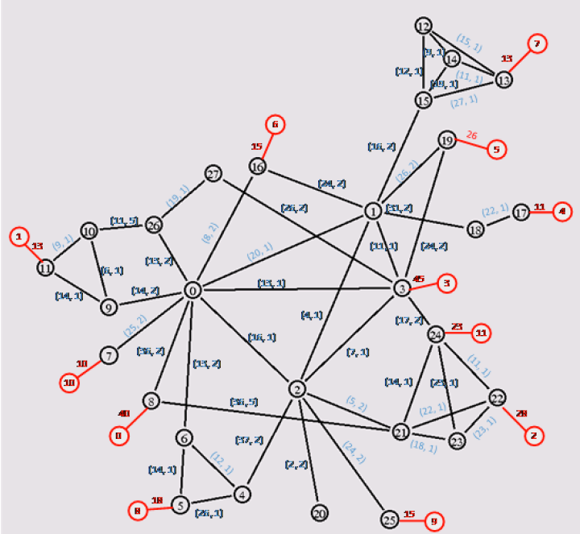

# Demo1（服务器放置问题）

[toc]

## 1. 问题描述

在给定结构的电信网络中，为了视频内容快速低成本的传送到每个住户小区，需要在这个给定网络结构中选择一些网络节点附近放置视频内容存储务器。

现已知：

1. 每条链路有带宽 $ Bandwidth^{Max} $ 与带宽成本 $ Cost^{Bandwidth} $ ；
2. 每台服务器有负荷能力 $ Capacity $ 与使用成本 $ Cost^{Service} $ ；
3. 每个消费节点有需求 $ Demand $ 。

给出视频内容存储服务器放置位置以及带宽链路，令服务器使用成本最小、链路使用成本最小，并满足以下条件：

1. 每个节点最多部署一台服务器；
2. 每台服务器最多部署到一个节点上；
3. 满足所有的住户小区视频播放需求；
4. 中转节点流量要平衡。

## 2. 数学模型

### 1) 回路上下文

#### (1) 变量

$ x_{is} $ ：在普通节点 $ i $ 部署服务器 $ s $ 。

#### (2) 中间值

##### 1. 是否在节点部署服务器

$$
Assignment^{Node}_{i} = \sum_{s \in S} x_{is}, \; \forall i \in N^{N}
$$

##### 2. 是否部署了服务器

$$
Assignment^{Service}_{s} = \sum_{i \in N^{N}} x_{is}, \; \forall s \in S
$$

#### 3) 目标函数

##### 1. 服务器部署成本最小

$$
min \quad \sum_{s \in S} Cost^{Service}_{s} \cdot Assignment^{Service}_{s}
$$

#### 4) 约束

##### 1. 每个节点最多部署一台服务器

$$
s.t. \quad Assignment^{Node}_{i} \leq 1, \; \forall i \in N^{N}
$$

##### 2. 每个服务器最多部署到一个节点

$$
s.t. \quad Assignment^{Service}_{s} \leq 1, \; \forall s \in S
$$

### 2) 带宽上下文

#### (1) 变量

$ y_{e_{ij}, s} $ ：服务器 $ s $ 占用普通节点 $ i $ 到节点 $ j $ 的链路的带宽。

#### (2) 中间值

##### 1. 使用带宽

$$
Bandwidth_{e_{ij}} = \sum_{s \in S} y_{e_{ij}, s}, \; \forall i \in N^{N}, \; \forall j \in N
$$

##### 2. 下行带宽

$$
Bandwidth^{Indegree, Service}_{js} = \sum_{i \in N^{N}} y_{e_{ij}, s}, \; \forall j \in N, \; \forall s \in S \\ \; \\
Bandwidth^{Indegree, Node}_{j} = \sum_{s \in S} Bandwidth^{Indegree, Service}_{js}, \; \forall j \in N
$$

##### 3. 上行带宽

$$
Bandwidth^{Outdegree, Service}_{is} = \sum_{j \in N} y_{e_{ij}, s}, \; \forall i \in N^{N}, \; \forall s \in S \\ \; \\
Bandwidth^{Outdegree, Node}_{i} = \sum_{s \in S} Bandwidth^{Outdegree, Service}_{js}, \; \forall i \in N^{N}
$$

##### 4. 净流出带宽

$$
Bandwidth^{OutFlow, Service}_{is} = Bandwidth^{Outdegree, Service}_{is} - Bandwidth^{Indegree, Service}_{is}, \; \forall
i \in N^{N}, \; \forall s \in S \\ \; \\
Bandwidth^{OutFlow, Node}_{i} = \sum_{s \in S} Bandwidth^{OutFlow, Service}_{is}, \; \forall i \in N^{N}
$$

#### (3) 目标函数

##### 1. 链路带宽使用成本最小

$$
min \quad \sum_{i \in N^{N}}\sum_{j \in N^{N}} Cost^{Bandwidth}_{e_{ij}} \cdot Bandwidth_{e_{ij}}
$$

#### (4) 约束

##### 1. 使用带宽不超过链路最大值，且只有服务器可以使用带宽

$$
s.t. \quad Bandwidth^{Max}_{e_{ij}} \cdot (1 - Assignment^{Service}_{s}) + y_{e_{ij}, s} \leq Bandwidth^{Max}_{e_{ij}},
\; \forall i \in N^{N}, \; \forall j \in N, \; \forall s \in S
$$

##### 2. 要满足消费节点需求

$$
s.t. \quad Bandwidth^{Indegree}_{i} \geq Demand_{i}, \; \forall i \in N^{C}
$$

##### 3. 中转节点流量平衡

$$
s.t. \quad Bandwidth^{Max, Outdegree}_{i} \cdot (1 - Assignment^{Node}_{i}) + Bandwidth^{OutFlow, Node}_{i} \leq
Bandwidth^{Max, Outdegree}_{i}, \; \forall i \in N^{N} \\ \; \\
\Rightarrow (1 - Assignment^{Node}_{i}) \cdot Bandwidth^{OutFlow, Node}_{i} = 0 \\ \; \\ \; \\
其中，Bandwidth^{Max, Outdegree}_{i} = \sum_{j \in N} Bandwidth^{Max}_{e_{ij}}, \; \forall i \in N^{N}
$$

##### 4. 服务器节点净输出不大于服务器能力

$$
s.t. \quad Capacity_{s} \cdot (1 - x_{is}) + Bandwidth^{OutFlow, Service}_{is} \leq Capacity_{s}, \; \forall i \in
N^{N}, \; \forall s \in S
$$
